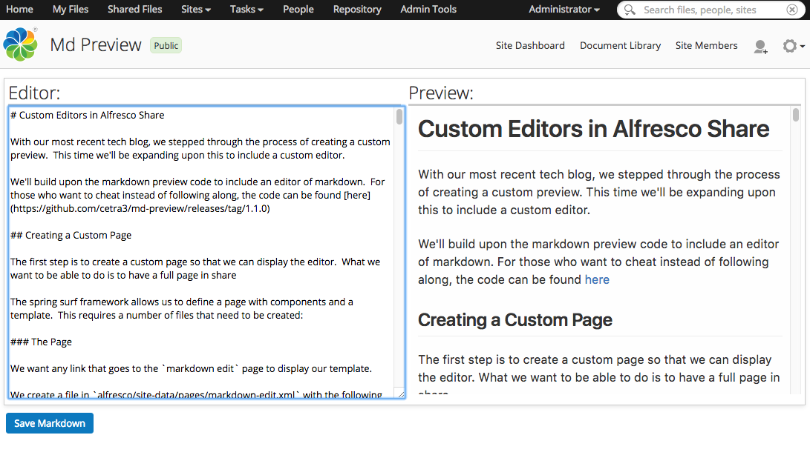

# Markdown Preview for Alfresco Share

This module adds a markdown preview and edit button to Alfresco Share:

This also adds a markdown editor:

## Compiling

You will need:

* Java 7 SDK or above
* Gradle
* Parashift's alfresco amp plugin from here: https://bitbucket.org/parashift/alfresco-amp-plugin
* Run `gradle amp` from the `share` and `repo` directories

## Installing to Alfresco

* Deploy the amp to both the repo and share end using alfresco-mmt or other methods

## Usage

### Previewing a Markdown document

* Navigate to the document details page of a markdown document

### Editing a Markdown document

* Find a markdown document within the document library
* Select `Edit Markdown`
* When you are finished, select `Save Markdown`
