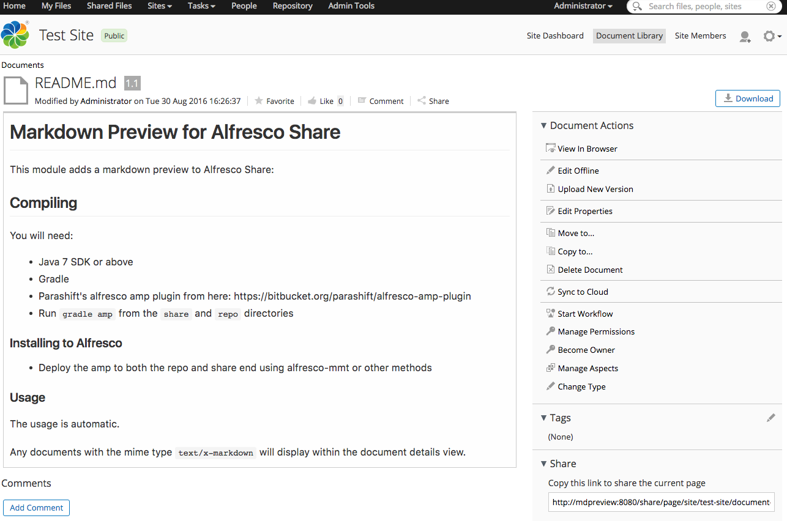

# Markdown Preview for Alfresco Share

This module adds a markdown preview to Alfresco Share:

## keensoft fork

Forked to allow classic Maven compiling

`mvn clean package`

Below, original notes from author.

## Compiling

You will need:

* Java 7 SDK or above
* Gradle
* Parashift's alfresco amp plugin from here: https://bitbucket.org/parashift/alfresco-amp-plugin
* Run `gradle amp` from the `share` and `repo` directories

### Installing to Alfresco

* Deploy the amp to both the repo and share end using alfresco-mmt or other methods

### Usage

The usage is automatic.

Any documents with the mime type `text/x-markdown` will display within the document details view.
